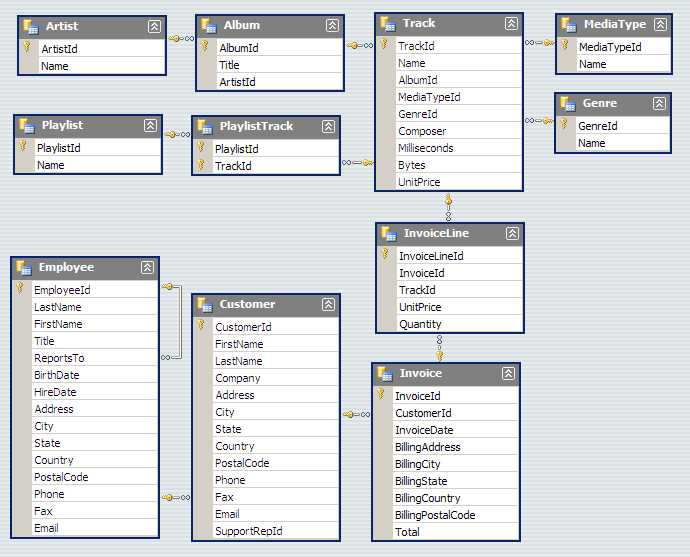

<!--

Licensed to Julian Hyde under one or more contributor license
agreements.  See the NOTICE file distributed with this work
for additional information regarding copyright ownership.
Julian Hyde licenses this file to you under the Apache
License, Version 2.0 (the "License"); you may not use this
file except in compliance with the License.  You may obtain a
copy of the License at

http://www.apache.org/licenses/LICENSE-2.0

Unless required by applicable law or agreed to in writing,
software distributed under the License is distributed on an
"AS IS" BASIS, WITHOUT WARRANTIES OR CONDITIONS OF ANY KIND,
either express or implied.  See the License for the specific
language governing permissions and limitations under the
License.

-->
[](https://github.com/julianhyde/chinook-data-hsqldb/actions?query=branch%3Amain)

# chinook-data-hsqldb
Chinook data set in hsqldb format

This project contains the Chinook data set as an embedded
HSQLDB database.

It originated as the
[Chinook database](https://github.com/lerocha/chinook-database)
version 1.4, which itself is an alternative to the
[Northwind database](https://docs.microsoft.com/en-us/dotnet/framework/data/adonet/sql/linq/downloading-sample-databases).

# Schema

Chinook's schema consists of 11 tables:

| Table         | Row count |
| :------------ | --------: |
| Album         | 347       |
| Artist        | 275       |
| Customer      | 59        |
| Employee      | 8         |
| Genre         | 25        |
| Invoice       | 412       |
| InvoiceLine   | 2,240     |
| MediaType     | 5         |
| Playlist      | 18        |
| PlaylistTrack | 8,715     |
| Track         | 3,503     |

Its size is about 900 KB uncompressed, 160 KB compressed.

Here is a schema diagram:



# Using the data set

The data set is packaged as a jar file that is published to
[Maven Central](https://search.maven.org/#search%7Cga%7C1%7Ca%3Achinook-data-hsqldb)
as a Maven artifact. To use the data in your Java application,
add the artifact to your project's dependencies:

```xml
<dependency>
  <groupId>net.hydromatic</groupId>
  <artifactId>chinook-data-hsqldb</artifactId>
  <version>0.2</version>
</dependency>
```

Now you can connect using Java code:

```java
import java.sql.Connection;
import java.sql.Statement;
import java.sql.ResultSet;

final String url = "jdbc:hsqldb:res:chinook";
final String sql = "select \"EmployeeId\", \"LastName\" from \"Employee\"";
try (Connection c = DriverManager.getConnection(url, "sa", "");
    Statement s = c.createStatement();
    ResultSet r = s.executeQuery(sql)) {
  while (r.next()) {
    System.out.println(r.getInt(1) + ":" + r.getString(2));
  }
}
```

You can also connect using a JDBC interface such as [sqlline](https://github.com/julianhyde/sqlline).
Make sure that `chinook-data-hsqldb.jar` is on the class path, and start `sqlline`:

```sql
$ ./sqlline
sqlline version 1.12.0
sqlline> !connect jdbc:hsqldb:res:chinook sa ""
0: jdbc:hsqldb:res:chinook> select count(*) from "chinook"."Track";
+----------------------+
|          C1          |
+----------------------+
| 3503                 |
+----------------------+
1 row selected (0.004 seconds)
0: jdbc:hsqldb:res:chinook> !quit
```

If you use username and password "CHINOOK" and "CHINOOK", the default
schema is "chinook", so you can omit the table prefix, if you wish:

```sql
$ ./sqlline
sqlline version 1.12.0
sqlline> !connect jdbc:hsqldb:res:chinook CHINOOK CHINOOK
0: jdbc:hsqldb:res:chinook> select count(*) from "Track";
+----------------------+
|          C1          |
+----------------------+
| 3503                 |
+----------------------+
1 row selected (0.004 seconds)
0: jdbc:hsqldb:res:chinook> !quit
```

## Get chinook-data-hsqldb

### From Maven

Get chinook-data-hsqldb from
<a href="https://search.maven.org/#search%7Cga%7C1%7Cg%3Anet.hydromatic%20a%3Achinook-data-hsqldb">Maven Central</a>:

```xml
<dependency>
  <groupId>net.hydromatic</groupId>
  <artifactId>chinook-data-hsqldb</artifactId>
  <version>0.2</version>
</dependency>
```

### Download and build

Java version 8 or higher.

```bash
$ git clone git://github.com/julianhyde/chinook-data-hsqldb.git
$ cd chinook-data-hsqldb
$ ./mvnw install
```

On Windows, the last line is

```bash
> mvnw install
```

## See also

Similar data sets:
* [flight-data-hsqldb](https://github.com/julianhyde/flight-data-hsqldb)
* [foodmart-data-hsqldb](https://github.com/julianhyde/foodmart-data-hsqldb)
* [scott-data-hsqldb](https://github.com/julianhyde/scott-data-hsqldb)
* [steelwheels-data-hsqldb](https://github.com/julianhyde/steelwheels-data-hsqldb)

## More information

* License: Apache License, Version 2.0
* Author: Julian Hyde
* Blog: http://blog.hydromatic.net
* Project page: http://www.hydromatic.net/chinook-data-hsqldb
* Source code: https://github.com/julianhyde/chinook-data-hsqldb
* Distribution: <a href="https://search.maven.org/#search%7Cga%7C1%7Ca%3A%22chinook-data-hsqldb%22">Maven Central</a>
* Developers list:
  <a href="mailto:dev@calcite.apache.org">dev at calcite.apache.org</a>
  (<a href="https://mail-archives.apache.org/mod_mbox/calcite-dev/">archive</a>,
  <a href="mailto:dev-subscribe@calcite.apache.org">subscribe</a>)
* Issues: https://github.com/julianhyde/chinook-data-hsqldb/issues
* <a href="HISTORY.md">Release notes and history</a>
